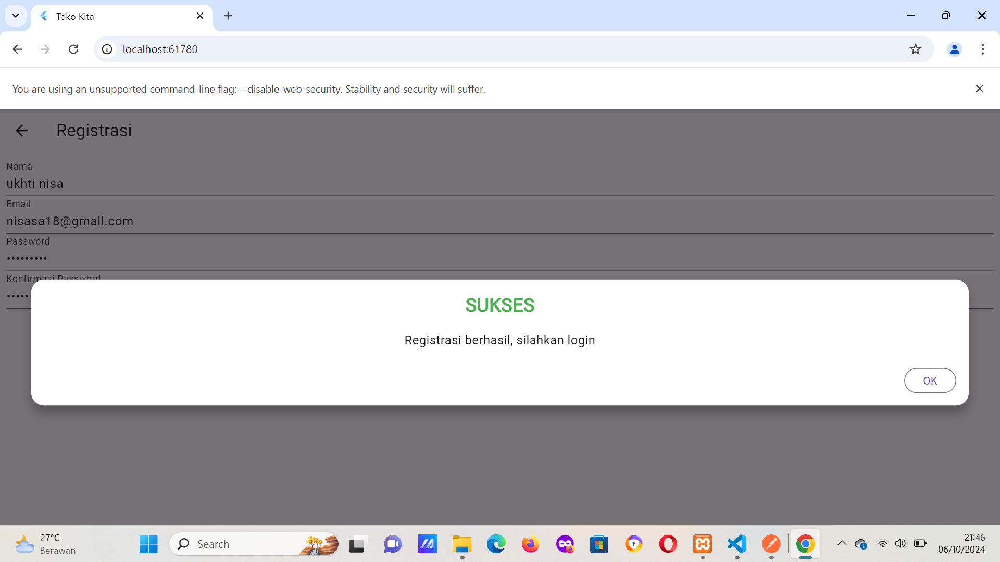
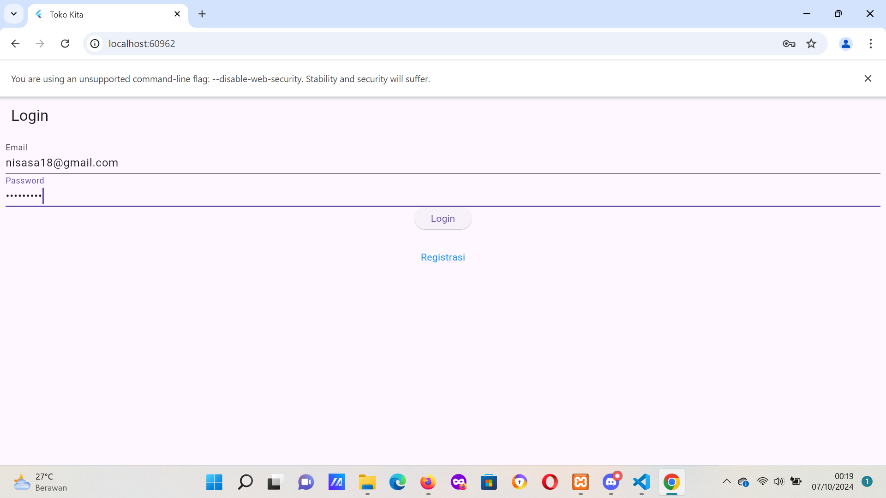
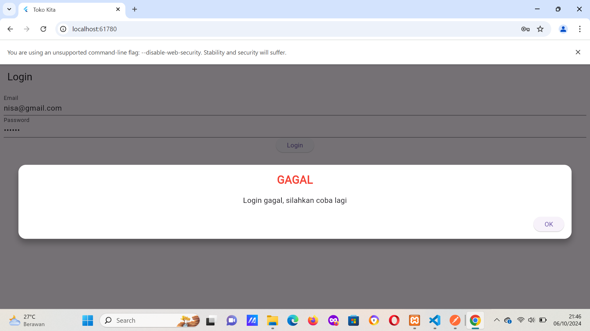
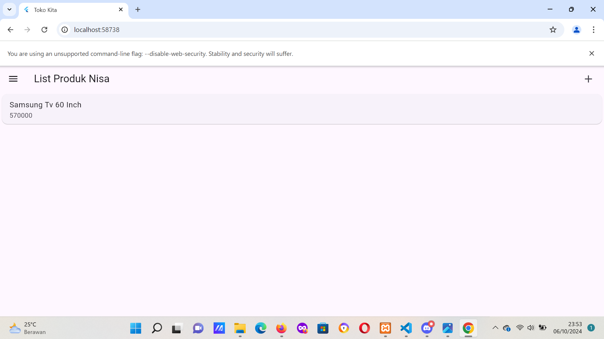
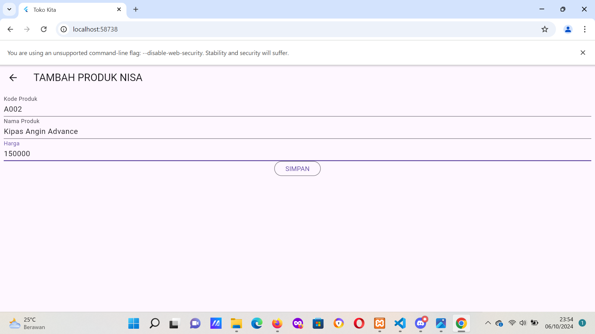
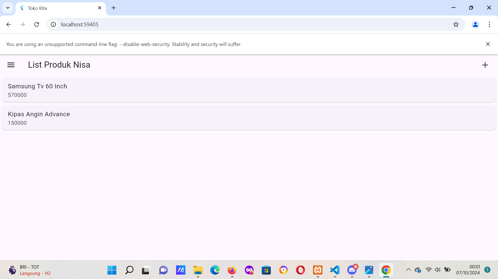
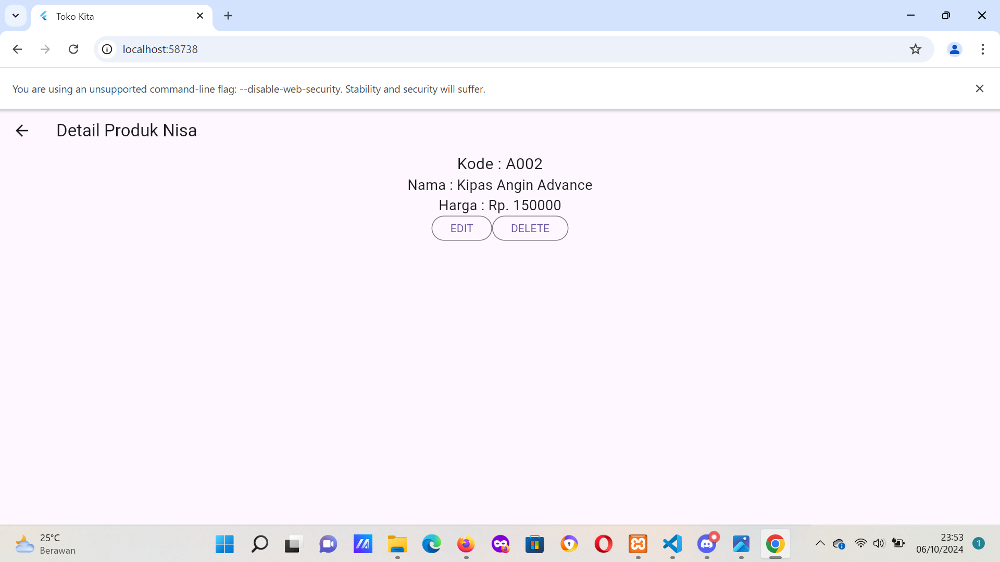
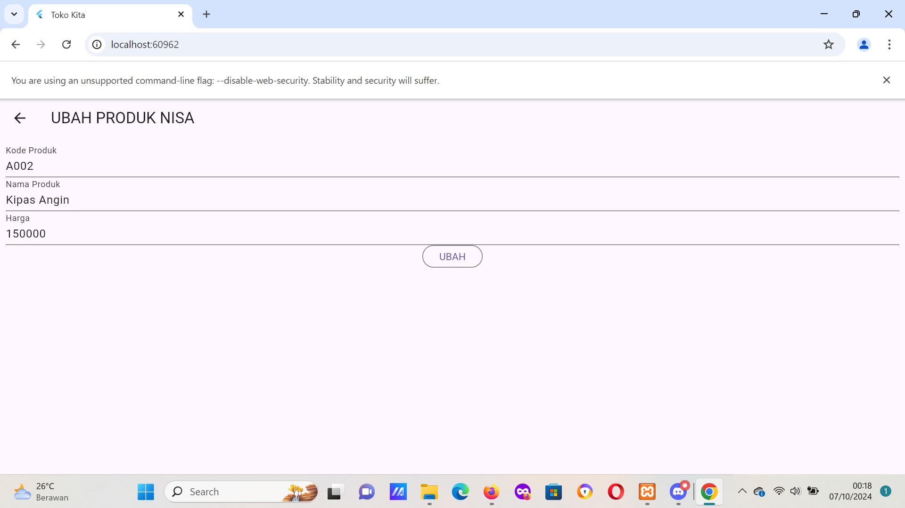
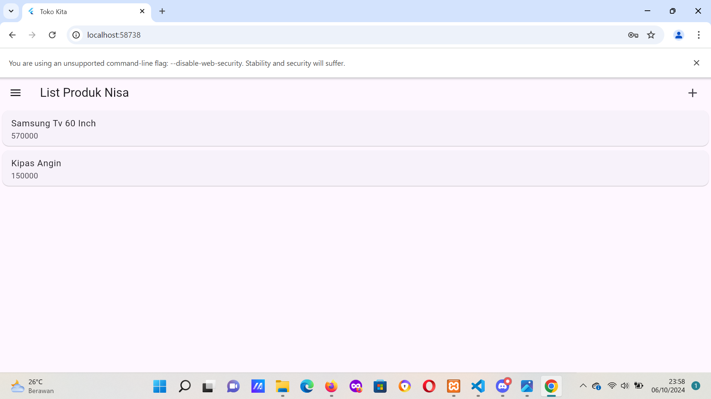

## Penjelasan kode

# 1. Register

# 2. Login
  a.login success
  
  b. gagal login
  

# 3. List produk

# 4. Tambah produk
  a. tambah produk
  
  b. list produk setelah tambah produk
  

# 5. Detail produk

# 6. Ubah produk
  a. ubah produk kipas
  
  b. detail produk setelah ubah produk
  
  c. list produk setelah diubah
  
  
# 7. delete produk
  a. delete produk
  
  b. list produk setelah di delete
  
